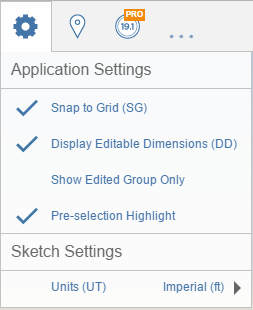

# Application Settings

Modify application-wide settings to change how the app appears and behaves.

- **Snap to Grid:** When enabled, the cursor will snap to grid intersections during operations like drawing lines and moving geometry.
- **Display Editable Dimensions:** Shows interactive dimensions during operations like drawing lines and moving geometry. When the editable dimensions are on screen, you can click them or hit Tab to adjust the values.
- **Show Edited Group Only:** When enabled, the context outside the current Group will be hidden. You can also hit shortcut H to toggle this option.
- **Pre-selection Highlight:** When enabled, model elements will highlight when the cursor hovers over them during certain tools like Select.
- **Sketch Settings:** Toggle between Imperial (ft) and Metric (m).

