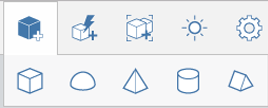

# Place Primitives

Use pre-defined shapes as design building blocks. Placing primitives provides a second way to create content.

## Place a Primitive

1.  Click one of the five shapes on the primitives palette.

2. Click in the canvas to place the shape.

