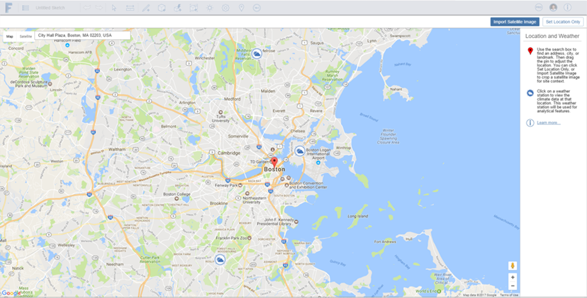

# Location

To accurately analyze your designs, you should define the geographic location of your sketch using the Location feature. Setting the location is important when you want to use Building Performance data while designing. See[ Building Performance](../Building Performance/README.md) for more details.

* You can [import](../Creating Designs/Import 3D Models and Images.md) context geometry using OBJ, STL or AXM formats.

  

#### Topics in this section

* [Set a Location](../Location/Set a Location.md) - Establish a geographic location for your sketch.

* [Import a Satellite Image](../Location/Import a Satellite Image.md) - Add detail and realism to your design.

* [Edit, Reload, or Remove a Satellite Image](../Location/Edit, Reload, or Remove a Satellite Image.md) - Make changes to your location images.

