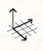

# Work Planes
 

When you change the world axes in the main sketch, or local axes inside a group, a work plane is associated with the X and Y axes. 

A work plane is a virtual 2-dimensional surface used as a base plane for sketching elements. This work plane stretches out to infinity and provides a surface to sketch on without snapping to elements behind/below it.

## Modifying Work Planes

The world axes and and Group axes have default work plane orientations along the default XY plane.

You may change the work plane orientation in the Main Sketch or in a Group by right-clicking on the canvas, and selecting Set Axes: 

Rotate the [world axes](../World Axes.md) to the plane of another object in the sketch. This will align the active work plane to correspond to this face. You can now sketch, place elements, and modify elements relative to the new XY plane, rather than the default ground plane. You can orbit behind or under the grid and work planes to snap and inference to elements behind it

If you do not see the grid lines then you need to turn them on to benefit from work plane based sketching (  > Visual Style > Display Grid or keyboard shortcut: DG)

