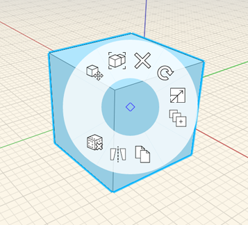

# Context Menu and Right-Side Palettes

* To view the context menu, right-click over a selected object or on empty space. Depending on the selection set, different tools will appear in the contextual menu. 
    
  Canvas context menu  
  Solid context menu   
  Groups context menu      
  Face context menu   

## Palettes

| | |
    | ---- | ---- |
    | Use the Properties palette to manage an object's name, Levels, Layers, and to view information about area and volume of the selected object.   |      |
    | Use the Materials palette to create, edit, and apply Materials to objects.   |      |
    | Use the Levels palette to create and edit the Levels in your sketch. You can set Levels on a selected object by switching to the Properties tab.   |      |
    |  Use the Content Library palette to link a library from your local computer, or from A360 Drive. Then you can drag and drop content from the library into your FormIt sketch.   |      |
    | Use the Collaboration palette to work simultaneously with others as you create designs.   |      |
    | Use the Layers palette to create and modify Layers. You can assign selected object(s) to a specific Layer to toggle their visibility.   |      |
    | Use the Scenes palette to create and modify Scenes. Press play to see an animation through all of the scenes in their current order. Each Scene contains options that, when checked, will be stored and used when that Scene is active.   |      |
