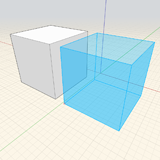
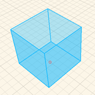

# Navigation Tools

## Floating Navigation Toolbar 
    
| | |
| ---- | ---- |
|  | *Top View*: Go to a top-down orthogonal view  *3D View*: Go to the default 3D perspective view  *Fly Through*: Walk around your model using gaming-inspired controls: W/A/S/D to move around, SPACE to fly, Q/E/F to move up/down/fall to ground, SCROLL while moving to adjust speed, ESC to exit  ----------  *Orbit*: Orbits around using your cursor or selection as the center of rotation. You can also right-click and drag at any time to Orbit.  *Swivel*: Looks around the model by using the current position as the center point. You can also hold Ctrl while right-click and dragging to Swivel.   *Pan*: Drags the view parallel to the screen. You can also hold the middle mouse button, or Shift while right-click and dragging to Pan.  ----------  *Zoom*: Zooms in or out with cursor movement  *Zoom All*: Zooms out to capture the extents of the sketch   *Zoom Selected*: Zooms to capture the extents of the geometry in selection  |

### Create Geometry Gestures

| Copy and Paste | Select an object, Ctrl + C to copy, Ctrl + V to paste or Ctrl + Shift + V to paste in place  |  |
| --- |
| Quick Copy and Paste | Select an object, click on the object to define the start point, start moving the object, then tap Ctrl to create a quick copy. |  |
| Draw 2D Shapes | Click on the line, arc, spline, circle, or rectangle tool, then click in canvas to draw. |  |
| Place a Primitive | Click on primitive from action bar, then click in the canvas. |  |
| Extrude Shapes | Click to select a face, then click and drag your mouse - click again to finish extruding a face. |  |

