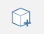
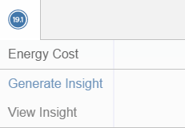

# User Interface Tools

## Main Toolbar

* The main toolbar is at the top of the screen and contains tools to assist in creating, editing, and sharing content.
    
    

*  Menu: access a variety of file-related operations such as Open, Save, Import, Export.
*  Sketch Name: Click to rename the sketch.
*  Undo and Redo: Click to undo or redo recent actions. Undo and Redo is per-Group.
*  Selection Filter: Click to choose options for filtering out object types when using area select (click and drag with Select tool).
* Measure Tools: Click to choose between Linear and Angular Measure tools.
*  Sketch Tools: Click to choose from various Sketch tools such as Line, Arc, Spline, Rectangle, and Circle.
*  Primitives: Click to choose from various 3D shapes such as Cube, Dome, Pyramid, Cylinder, Roof.
*  Advanced Tools: Click to choose from advanced tools such as Boolean Join and Cut, Sweep, Cover, Loft, 3D Offset, 3D Shell, and Fillet.
*  Groups: Click to choose from Group tools such as Create, Edit, Make Unique, Ungroup, Ungroup All, and Flatten.
*  Sun and Shadows: Use this tool to change the date and time of day to study shadows on your model. For more information on sun and shadows, see [Sun and Shadow Settings](../../Building Performance/Sun and Shadow Settings.md). You may also launch Solar Analysis from within this panel.
*  Settings: Click to set application and sketch settings, such as snapping, editable dimensions, selection and context visibility, and units.
*  Search for a location and import satellite imagery into your sketch. For more information on setting the location of your sketch, see [Location](../../Location.md).
*  Energy Analysis: Click to perform calculations on a building to determine its energy use using Autodesk Insight.
*  Go Pro! Click to gain access to Solar Analysis, Energy Analysis, and Collaboration features.
*  Log in to Autodesk 360: Use the Autodesk 360 cloud services for free to store and share your sketches.
*  Help: Click to find out what FormIt is about, what's new in this release, and get access to forums, galleries, videos, and learn application shortcuts.

## Floating Navigation Toolbar 
    
    | | |
    | ---- | ---- |
    |    |  *Top View*: Go to a top-down orthogonal view  *3D View*: Go to the default 3D perspective view  *Jet Pack*: Walk through your model using gaming-inspired controls: W/A/S/D to move around, SPACE to fly, Q/E/F to move up/down/fall to ground, SCROLL while moving to adjust speed, ESC to exit  *Select*: Puts you back into Select mode  *Orbit*: Orbits around using your cursor or selection as the center of rotation  *Swivel*: Looks around the model by using the current position as the center point  *Pan*: Drags the view parallel to the screen  *Zoom*: Zooms in or out with cursor movement  *Zoom All*: Zooms out to capture the extents of the sketch   *Zoom Selected*: Zooms to capture the extents of the geometry in selection   |

## Palette Bar

The Palette Bar appears on the right side of the screen. Click one of these icons to open a side palette to display Properties, Layers, Scenes, Levels, Content Library, and Collaboration.

| | |
| ---- | ---- |
|    |    *Properties*: Open this palette to view location, gross area, and floor area ratios for your sketch  *Materials*: Use this palette to create or apply materials  *Layers*: Create and Manage Layers and assign selected objects to different Layers  *Scenes*: Create, manage and play Scenes  *Levels*: Use this palette to display and add levels to your building objects  *Content Library*: Use the content library to store reusable content such as furniture  *Collaboration* (FormIt Pro only): Use Collaboration to work simultaneously with others as you create designs   |

