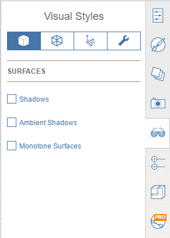

# Visual Styles

Visual Styles provides a one-stop shop for tweaking the display of model surfaces, edges, and its environment. Visual Styles also provides options for toggling helpful diagnostic options.

##Surfaces

- **Shadows:** Display shadows based on sketch location and selected time of day.
- **Ambient Shadows:** Display soft shadows for an added touch of realism.
- ** Monotone Surfaces:** Display all surfaces with a white material, except transparent surfaces which become grey. Great for shadow studies.

#Edges

- **Edges:** Display edges on the model.
- **Contrast:** Adjust the relative visibility of edges against model surfaces.
- **Thick Edges:** Display thickened edges.
- **Sketchy Edges:** Display edges with a sketch-like effect.
- **Hidden Edges:** Display edges behind surfaces for a wireframe effect.
- **Extended Edges:** Draw a slight extension to edges for a sketch-like effect.
- **Silhouettes:** Display thicker lines around perimeters of objects to emphasize form.
- **Silhouette Contrast:** Adjust the relative visibility of silhouette edges against model surfaces.

#Environment

#Diagnostics

*Display edges*: Toggle this feature to turn off edges in your model. This option works well with Ambient shadows for presentations * *Display silhouette outlines*: Forms will be emphasized by drawing a slightly wider line around the silhouette edges * *Display wide lines*: Widest lines possible * *Display sketchy lines*: Change the appearance of your sketch by toggling making lines to appear that they have been sketched by hand * *Show hidden lines*: Display faint lines that are normally hidden by other faces * *Display extended edges*: Display short extensions where lines intersect * *Display grid*: Toggle the visibility of the grid * *Display axes: *Toggle the visibility of the coordinate system axes * *Display north arrow: *Toggle the visibility of the north arrow * *Display levels*: Toggle the visibility of the levels    |
|    |    *Model Diagnostics*  * *Display Backfaces: *Faces that are abnormally facing outward will be displayed in a purple color * *Display Watertight Issues*: Holes in faces and lines/edges not associated with an object will be displayed in a purple color   |

