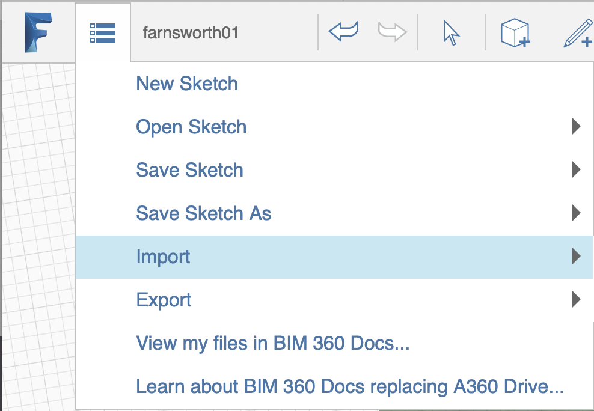
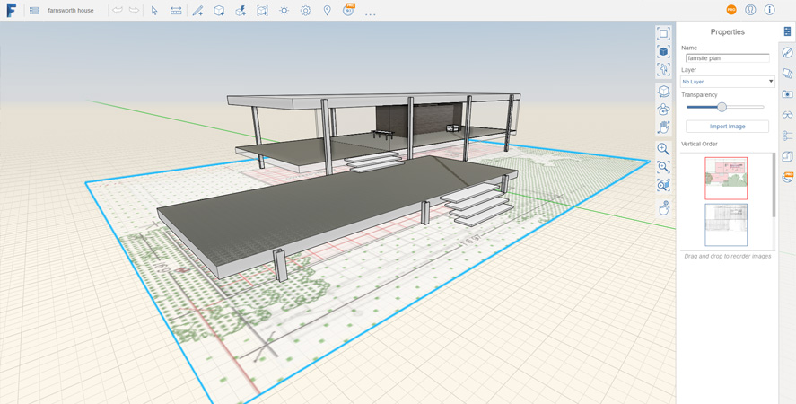

# Importing Models and Images

FormIt supports importing 3D geometry and raster image files.

## Importing Models

1. To import a 3D model, select the Import button from the menu.
2. Supported files will show up in your file browser.

## Importing Images

1. To import an image, select the Import button from the menu.

1. Select an image from your local file system
2. Edit the image if necessary.

   

3. Click OK to add the image.

## Modifying Images

1. Double-click the image to select it
2. Navigate to the Properties palette
3. From here, you can adjust the name, Layer, transparency setting, import more images, and adjust the vertical order by dragging the tiles representing other images in the sketch.

