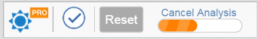

# Solar Analysis

Visualize the amount of solar radiation that your model receives.

Autodesk FormIt Pro Only

1. Click on the Sun and Shadows icon.

   

2. Select an object or face.

   

3. Click Analyze.

   

4. View the Solar Analysis graph.

   

5. Click the  symbol to toggle between Month Peak or Year Cumulative.

   Change between Month Peak, which gives the peak solar insolation value in BTU/sq ft \(or Wh/sq m\) for each month, and Year Cumulative, which gives the total insolation in kw/Sq m. Month Peak is useful for developing a shading strategy for the building façade. Year Cumulative is useful for determining the potential for photovoltaic cells.

6. Move the slider to vary the time of year.
7. Click  to finish.

