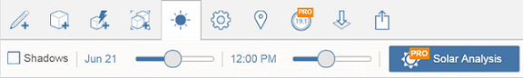

# Sun and Shadow Settings

Control the angle of the shadows at your locations by setting date and time.

* You can control the sun path and shadows by clicking Shadows and setting the date and time for each sketch.

  

Sun and shadows settings can be edited by tapping on the sun icon in the bottom toolbar. First, toggle on shadows. Then, use the slider or pick a specific date and time to set the position of the sun.

