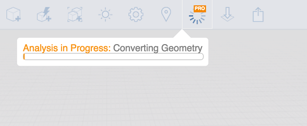

# Whole Building Energy Analysis

Evaluate factors that affect building performance, such a wall insulation and HVAC efficiency.

Autodesk FormIt Pro Only

The FormIt Pro Energy Analysis feature allows you to better understand how your design will perform based on a number of factors. To get started, you must first set a [Location for your project](../location/) and have at least one solid object with [Levels](https://github.com/formit3d/autodesk-formit-360-web-help/tree/b94092a615fd6c673021a2b2f7cc67dcd4ba45ce/Levels%20and%20Space%20Usage/README.md) applied. Click the Energy Analysis button to start the analysis process.

The model will be converted and sent to Autodesk Insight for analysis. When the results are ready, you will receive an email. Open the Energy Analysis Dashboard by clicking View Results.

The Energy Analysis Dashboard now contains a 3D view of the energy model, a history of previous runs, and the Energy Cost Range \(ECR\). The range shows the mean, minimum, and maximum energy cost from batch runs of whole building energy simulations for a range of typical design and operational factors. The ECR also includes the [Architecture 2030](http://architecture2030.org/2030_challenge/the_2030_challenge) benchmark for your project. This benchmark provides a way to understand the relative performance of your project by comparing to this popular target. The Architecture 2030 benchmark is calculated as a percentage \(currently 60%\) of real historical building energy use gathered from extensive surveys. The ECR contains, and is ultimately driven by individual factors, each of which relate to different aspects of building features that influence building energy use.

When you open a Factor Widget, you can vary the factors to see how it affects the Energy Cost Mean.

