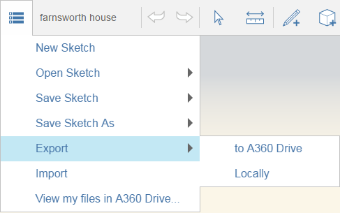

# Collaboration

Work simultaneously with others on the same sketch, or share your work later.

**Note:** Collaboration works only after you activate FormIt Pro. Clicking on the Collaboration icon will prompt you to log in with an Autodesk account entitled for FormIt Pro.

* You can start a Collaboration session and let others see your design and see any edits you make.

  

In addition to simultaneous collaboration through shared sessions, you can share the work you have created in various other ways. From emailing images of your design, to exporting your sketches so that they can be used in other programs, you can easily let others review your work.

* Sharing options can be accessed from the Action toolbar by clicking the File icon in the upper left. You can share your work either by exporting to your BIM 360 Docs account or your local drive. See [Export files and images.](https://github.com/formit3d/autodesk-formit-360-web-help/tree/b94092a615fd6c673021a2b2f7cc67dcd4ba45ce/Manage%20Your%20Data/Export%20Files%20and%20Images.md)

  

## See Also

* [Export Files and Images](https://github.com/formit3d/autodesk-formit-360-web-help/tree/b94092a615fd6c673021a2b2f7cc67dcd4ba45ce/Manage%20Your%20Data/Export%20Files%20and%20Images.md)
* [ Saving Your Work](https://github.com/formit3d/autodesk-formit-360-web-help/tree/b94092a615fd6c673021a2b2f7cc67dcd4ba45ce/Manage%20Your%20Data/Saving%20Your%20Work.md)

## Topics in this section

* [Start and Stop Collaboration Sessions](https://github.com/formit3d/autodesk-formit-360-web-help/tree/b94092a615fd6c673021a2b2f7cc67dcd4ba45ce/Start%20and%20Stop%20Collaborative%20Sessions.md)

  Invite other people to work on the same design project.

* [Joining a Session](https://github.com/formit3d/autodesk-formit-360-web-help/tree/b94092a615fd6c673021a2b2f7cc67dcd4ba45ce/Joining%20a%20Session.md)

  Join a Collaboration session.

* [Inviting Others to a Session ](https://github.com/formit3d/autodesk-formit-360-web-help/tree/b94092a615fd6c673021a2b2f7cc67dcd4ba45ce/Inviting%20Others%20to%20a%20Session.md)

  Create a Collaboration team.

* [Following a Session Camera](https://github.com/formit3d/autodesk-formit-360-web-help/tree/b94092a615fd6c673021a2b2f7cc67dcd4ba45ce/Following%20a%20Session%20Camera.md)

  View the work from another collaborator's point of view.

* [Chat with Collaborators ](https://github.com/formit3d/autodesk-formit-360-web-help/tree/b94092a615fd6c673021a2b2f7cc67dcd4ba45ce/Chat%20with%20Collaborators.md)

  Engage in dialog as you design.

