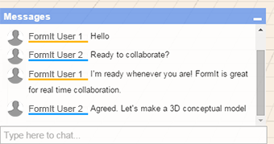

# Chat with Collaborators

Engage in dialog as you design.

* Use the 'Messages' feature in the lower left corner of the application window. Just type in your message and keep track of your correspondence during the sharing session.

  

