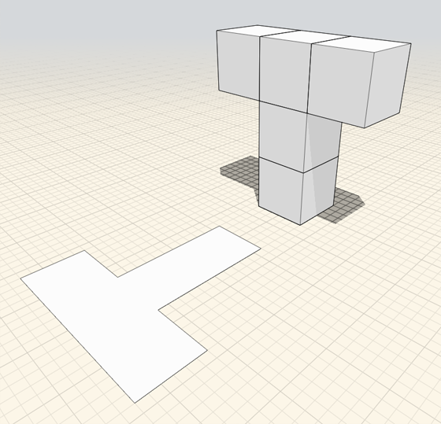
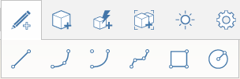
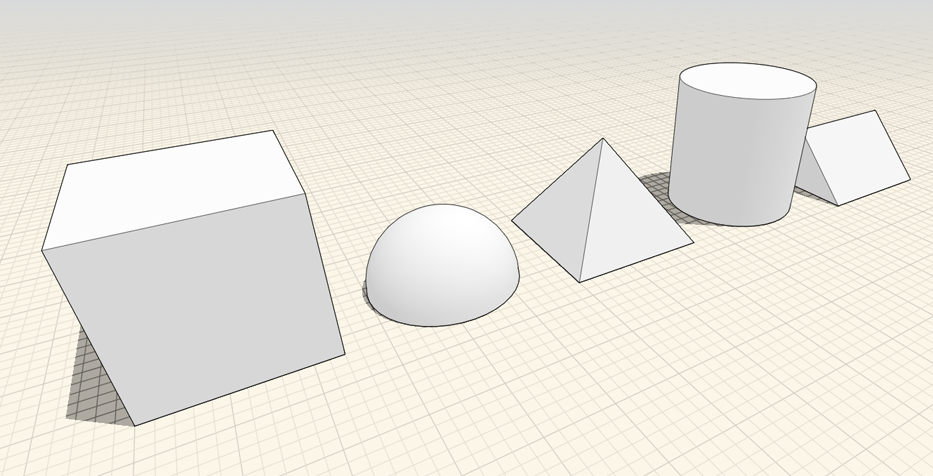

# Creating Designs

Use FormIt to create conceptual models using 2D and 3D geometry creation tools. Start off by sketching 2D shapes or placing 3D primitives. You can then modify your designs by extruding faces and by using various transform tools and boolean operations.

There are two main ways to create geometry: Sketching shapes, and placing primitives. You can also import geometry.

There are 5 types of tools that you can sketch with: Lines, Arcs, Splines, Rectangles, and Circles.

## Sketching Shapes

Creation tools are located in the action bar. You create shapes by clicking on a tool from the Sketch tool set. Then, click in the canvas to begin drawing the shape.

There are 5 types of 3D primitives that you can place: Cubes, Domes, Cylinders, Prisms, and Pyramids.

## Placing Primitives

You can place primitives by clicking on a shape from the Geometry toolbar. Then, click in the canvas to place the geometry.

To create more complex designs after sketching a shape or placing a primitive, you can use several contextual tools to modify your geometry. These operations include: Select, Delete, Move, Scale, Rotate, Extrude, Offset Face, Tilt, Copy/Paste, Array, Cover, Sweep, Loft, Offset Solid, Shell Solid, Fillet, and Boolean Cut and Join. Use the topics in the following list to learn more about these operations.

## See Also

* [Modify: Delete/Edit/Move ](https://github.com/formit3d/autodesk-formit-360-web-help/tree/b94092a615fd6c673021a2b2f7cc67dcd4ba45ce/Modify%20Designs/Modify%20Delete,%20Edit,%20Move.md)
* [Modify: Extrude/Cut/Offset Face ](https://github.com/formit3d/autodesk-formit-360-web-help/tree/b94092a615fd6c673021a2b2f7cc67dcd4ba45ce/Modify%20Designs/Modify%20Extrude,%20Cut-Offset%20Faces.md)
* [Modify: Select Edge/Face ](https://github.com/formit3d/autodesk-formit-360-web-help/tree/b94092a615fd6c673021a2b2f7cc67dcd4ba45ce/Modify%20Designs/Modify%20Select%20Edge-Face%20or%20Object.md)
* [Modify: Scale/Rotate ](https://github.com/formit3d/autodesk-formit-360-web-help/tree/b94092a615fd6c673021a2b2f7cc67dcd4ba45ce/Modify%20Designs/Modify%20Scale%20and%20Rotate.md)
* [Modify: Tilt/Array/Copy/Paste ](https://github.com/formit3d/autodesk-formit-360-web-help/tree/b94092a615fd6c673021a2b2f7cc67dcd4ba45ce/Modify%20Designs/Modify%20Tilt,%20Array,%20Copy-Paste.md)
* [Modify: Boolean Operations ](https://github.com/formit3d/autodesk-formit-360-web-help/tree/b94092a615fd6c673021a2b2f7cc67dcd4ba45ce/Modify%20Designs/Modify%20Boolean%20Operations.md)
* [Modify: Cover/Sweep/Loft ](https://github.com/formit3d/autodesk-formit-360-web-help/tree/b94092a615fd6c673021a2b2f7cc67dcd4ba45ce/Modify%20Designs/Modify%20Cover,%20Sweep,%20Loft.md)

## Topics in this section

* [Sketching Shapes](https://github.com/formit3d/autodesk-formit-360-web-help/tree/b94092a615fd6c673021a2b2f7cc67dcd4ba45ce/Creating%20Designs/Sketching%20Shapes.md) - Use Lines, Arcs, Splines, Rectangles, and Circles to create shapes that you can combine into building designs.
* [Place Primitives](https://github.com/formit3d/autodesk-formit-360-web-help/tree/b94092a615fd6c673021a2b2f7cc67dcd4ba45ce/Creating%20Designs/Place%20Primitives.md) - Use pre-defined shapes as design building blocks.

