# Sketching Shapes

Use Lines, Arcs, Splines, Rectangles, and Circles to create foundational shapes for your building designs.

After selecting a drawing tool, you can hover anywhere on the canvas and use snaps and inference points as you place your first and subsequent points.

## Sketching Lines

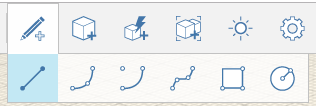 1. Click once in the canvas to place the first endpoint of the line. 2. Use snapping and/or inference lines to locate and place the second endpoint of the line. 3. To draw the next line segment, you will need to click to create another endpoint.

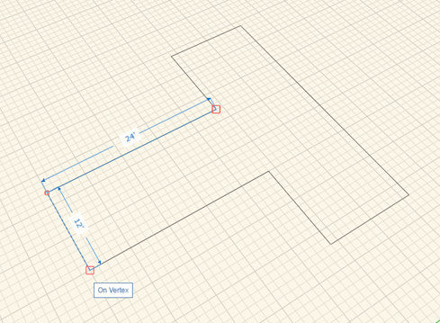

Once you start drawing a line on an axis, pressing Shift locks the line to that axis so that you can extend it without worrying about leaving the axis.

Use the Tab key to open the Set Length dialog that allows you to type in a length value. When Snap to Grid is turned off, the values in the Set Length box appear in whole numbers; with Snap to Grid on, the numbers appear in fractions of a foot or meter. Any time a temporary dimension string is on the screen, Tab will allow you to edit the most recently entered dimension.

## Sketching 3-Point Arcs

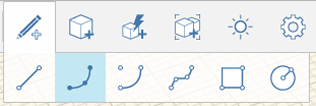 1. Click once in the canvas to place the first endpoint of the arc. 2. Use snapping and/or inference lines to locate and place the second endpoint of the arc. 3. Click once more to set the bulge dimension of the arc.

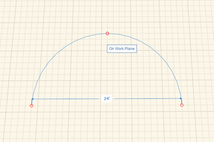

## Sketching Arcs by Center, Radius

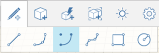 1. Click once in the canvas to place the first endpoint of the arc. 2. Use snapping and/or inference lines to locate and place the centerpoint of the arc. 3. Use the radial dimension to set the end point of the arc.

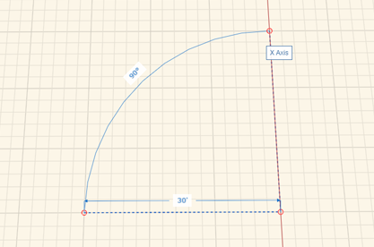

## Sketching Splines

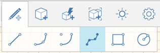 1. Click once in the canvas to place the first Spline point. 2. Continue adding points, and the Spline will automatically draw. 3. Optionally close the Spline by adding a point on the starting point.

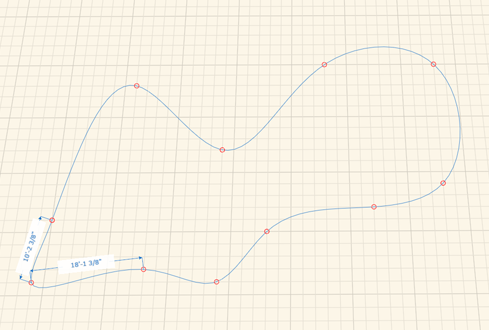

## Sketching Rectangles

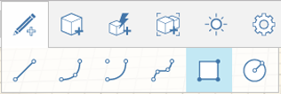 1. Click once in the canvas to place the first corner of the rectangle. 2. Move in the desired direction for the first edge of the rectangle, and place the second point. 3. Finally, follow the same steps as before to place the third point and final corner of the rectangle.

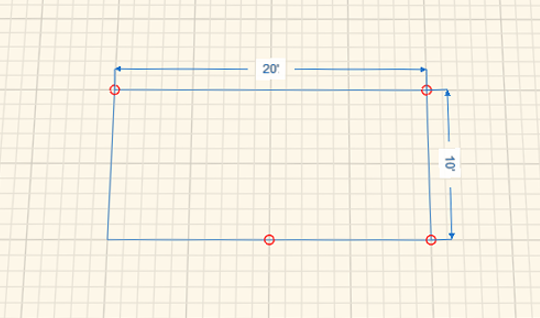

## Sketching Circles

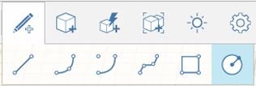 1. Click once in the canvas to place the circle centerpoint. 2. Move the cursor away from the centerpoint to define the circle radius, and click to place the circle.

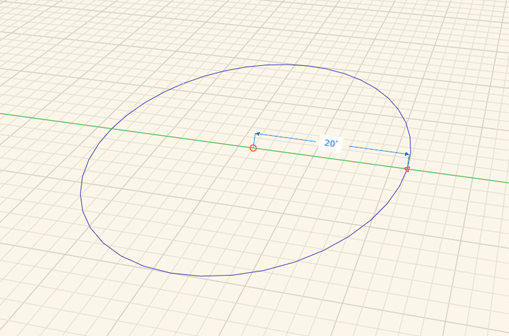

