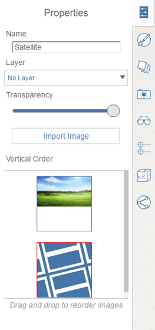

# Edit, Reload, or Remove a Satellite Image

1. To remove or edit a satellite image:
2. Double click to select the image and then press Delete; or,
3. Double click to select the satellite image, then right click over the image to bring up the context menu; chose the delete icon.

## To Edit satellite images:

1. Similar to other images, you can edit the name, transparency, and vertical order of a satellite image. Double-click the image and switch to the Properties panel:

   

