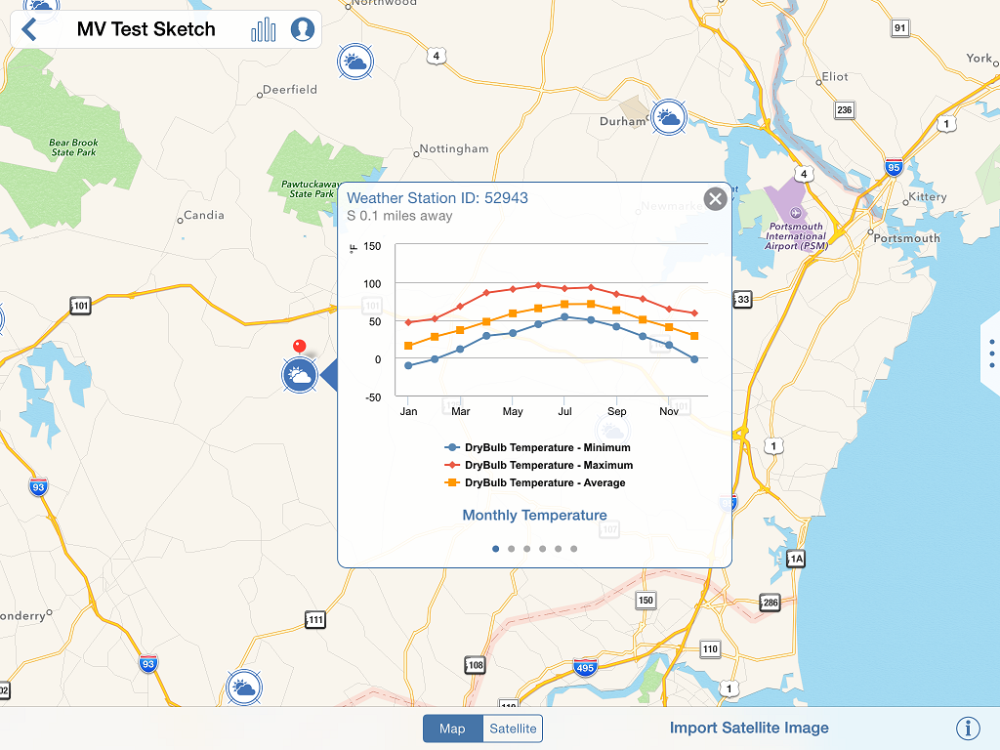

# Import a Satellite Image

1. Click on the Location icon  from the action tool bar.
2. Search for a specific location or use the map view to pan and zoom to set a location.
3. Click to place the red pin after you have found your location.
4. Click Import Satellite Image to add the aerial photo to your sketch.
5. Use the dialog that appears to crop the satellite image to show the relevant context for your sketch.
6. Click 'Import Satellite Imager'

   

## Weather Stations

1. Click any of the nearby Weather Stations to review the local historic climate data.
2. Click the X in the upper right corner to dismiss the weather station display.

