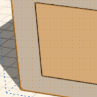

# About Smart Selection

Use the **Tab** key to make selecting similar objects easier.

* Select identical Groups: Hover over a Group and hit Tab to select all instances of that Group in the current context.
* Select same sized faces: Hover over a face, hit the tab key, all the faces on the solid that are the same size highlight - single click to select them all.

  

* Select cluster of faces: Hover over a face that is part of a cluster of faces, hit the tab key twice, all the faces that are part of the cluster highlight - single click to select them all

  

* Depth selection: Hover over a face that is on top of a group instance, hit the space bar to cycle through selection options are in the same plane, click to select the face you want

  

* 3D edge loops: hover over a loop on a 3D shape, and put your cursor just off-center towards the side where you want to quickly select a contiguous edge loop. Hit Tab to pre-select the loop. It might take some practice to get the loop that you want.

