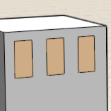
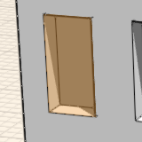

# About Smart Selection

Use the Tab key to make selecting similar objects easier.

* Select identical Groups: Hover over a Group and hit Tab to select all instances of that Group in the current context. 
* Select same sized faces: Hover over a face, hit the tab key, all the faces on the solid that are the same size highlight - single click to select them all.

  

* Select cluster of faces: Hover over a face that is part of a cluster of faces, hit the tab key twice, all the faces that are part of the cluster highlight - single click to select them all

  

* Select same sized cluster of faces: Hover over a face that is part of a cluster of faces, hit the tab key three times, all the clusters of faces that are the same size on the solid highlight - single click to select them all

  

* Depth selection: Hover over a face that is on top of a group instance, hit the space bar to cycle through selection options are in the same plane, click to select the face you want

  

