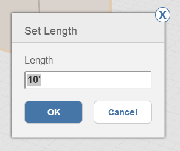

# Modify: Delete, Edit, Move

Remove an object, change its location, or modify its properties.

1.  To delete geometry, you must first make a geometry selection. Then, right-click to see the context menu where you can click on the delete icon. You can also press the delete key on your keyboard.
2. When using many of the editing tools like Move, Array, Push Pull Face, and Offset, you will see a blue dimension box. You can click this dimension after you finish your operation, and input a specific value. You can also press the Tab key to access the Edit Dimension dialog.
3.  To move edges, faces, or objects, first select, then you are automatically in the move tool. Hover to see snaps and inference points to specify where you want to start your move operation, click to start. Now hover your mouse to see snaps and inference points to the location you want to move the object. Click again to place the object.

