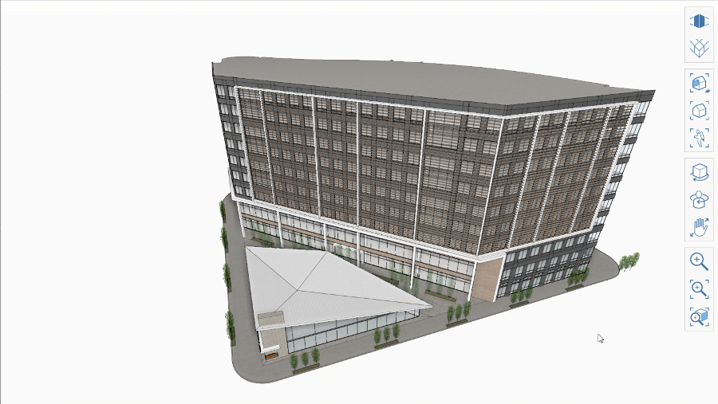

# Orthographic Camera

The Orthographic Camera feature works the same in FormIt Web as it dies in FormIt Windows. To learn more about the Orthographic Camera, see [Orthographic Camera for Windows.](https://app.gitbook.com/@formit3d/s/autodesk-formit-360-windows-help/tool-library/orthographic-camera)

If you navigate manually to a pre-set Orthographic View, like Top View, or Front View, the Orthographic Camera will snap to that position,  making it easier to access those pre-set views.

**Note:** If camera clipping occurs in Orthographic Camera mode, you can switch back to Perspective Mode, zoom out, and then try again. 

