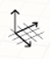
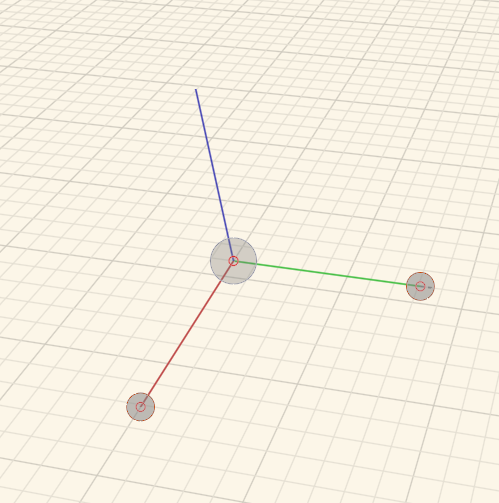

# Work Planes

A work plane is a virtual 2-dimensional surface used as a base plane for sketching elements. This work plane stretches out to infinity and provides a surface to sketch on without snapping to elements behind/below it.

## Modifying Work Planes

The world axes and and Group axes have default work plane orientations along the default XY plane.

You may change the work plane orientation in the Main Sketch or in a Group by right-clicking on the canvas, and selecting Set Axes: 

Grab the dot at the end of the red axis, and align it to a surface of another object in the sketch.

This will align the active work plane \(whether in a Group or in the Main Sketch\) to correspond to this face. You can now sketch, place elements, and modify elements relative to the new XY plane, rather than the default ground plane.

You can orbit behind or under the grid and work planes to snap and inference to elements behind it.

If you do not see the grid lines, you'll need to turn on the Grid in [Visual Styles](https://github.com/formit3d/autodesk-formit-360-web-help/tree/b94092a615fd6c673021a2b2f7cc67dcd4ba45ce/Visualizing%20Your%20Design/Visual%20Styles.md) &gt; Environment &gt; Grid \(or keyboard shortcut: DG\)

