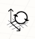

# World Axes

The default coordinate system and grid can be modified by changing the world axis.

When a blank sketch is opened in FormIt the World Axes are displayed as three red, green and blue lines in the center of the screen. These three lines define the three Cartesian directions that define the 3D world. The "X" direction is defined by the red line, the "Y" direction by the green line and the "Z" or "up" direction by the blue line.

To rotate the grid, right click/tap on empty space in the scene and choose from the context menu.

Drag the large grip to adjust the origin location, or drag the dots on the ends of X or Y axes to adjust the axes orientation.

To reset the coordinate system and grid back to the default setting, right click/tap on empty space in the scene and choose .

