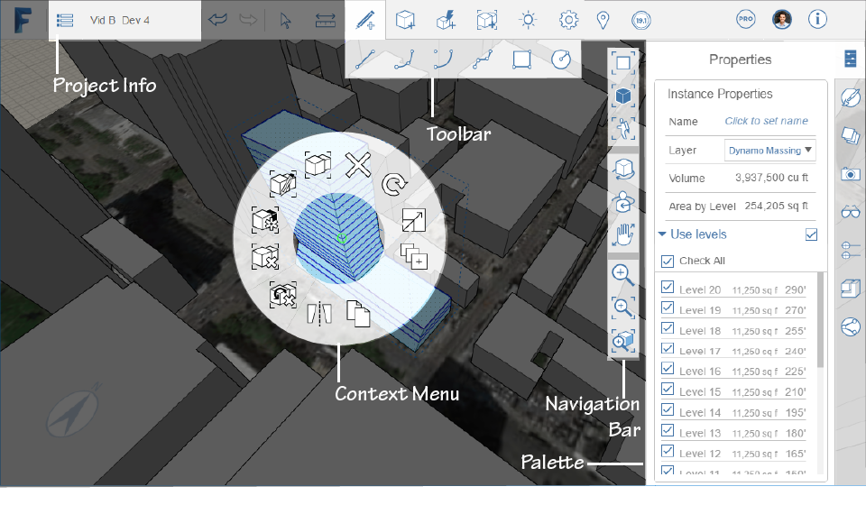

# User Interaction

## Topics in this section

* [Context Menu and Right-Side Palettes](https://github.com/formit3d/autodesk-formit-360-web-help/tree/b94092a615fd6c673021a2b2f7cc67dcd4ba45ce/Context%20Menu%20and%20Right-Side%20Palettes.md) - Locate the tools to create and place designs.
* [User Interface Tools ](https://github.com/formit3d/autodesk-formit-360-web-help/tree/b94092a615fd6c673021a2b2f7cc67dcd4ba45ce/User%20Interface%20Tools.md) - Reference for command interaction tools.
* [Project Information Reference ](https://github.com/formit3d/autodesk-formit-360-web-help/tree/b94092a615fd6c673021a2b2f7cc67dcd4ba45ce/Project%20Information%20Reference.md) - Name your design and keep track of its status.
* [Navigation Tools](https://github.com/formit3d/autodesk-formit-360-web-help/tree/b94092a615fd6c673021a2b2f7cc67dcd4ba45ce/Navigation%20Tools.md) - Use these movements to engage the user interface.
* [Keyboard Shortcuts ](https://github.com/formit3d/autodesk-formit-360-web-help/tree/b94092a615fd6c673021a2b2f7cc67dcd4ba45ce/Keyboard%20Shortcuts.md) - Speed up your design work with keyboard shortcuts.

