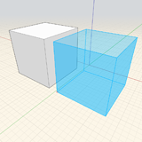
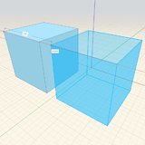
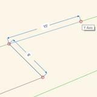
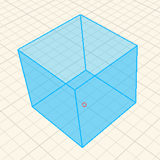
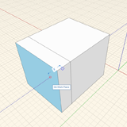

# Navigation Tools

## Floating Navigation Toolbar

|  |  |
| :--- | :--- |
|  | _Top View_: Go to a top-down orthogonal view  _3D View_: Go to the default 3D perspective view  _Fly Through_: Walk around your model using gaming-inspired controls: W/A/S/D to move around, SPACE to fly, Q/E/F to move up/down/fall to ground, SCROLL while moving to adjust speed, ESC to exit  ----------  _Orbit_: Orbits around using your cursor or selection as the center of rotation. You can also right-click and drag at any time to Orbit.  _Swivel_: Looks around the model by using the current position as the center point. You can also hold Ctrl while right-click and dragging to Swivel.   _Pan_: Drags the view parallel to the screen. You can also hold the middle mouse button, or Shift while right-click and dragging to Pan.  ----------  _Zoom_: Zooms in or out with cursor movement  _Zoom All_: Zooms out to capture the extents of the sketch   _Zoom Selected_: Zooms to capture the extents of the geometry in selection  |

### Quick Geometry Creation

| Copy and Paste | Select an object, Ctrl + C to copy, Ctrl + V to paste or Ctrl + Shift + V to paste in place |  |
| :--- | :--- | :--- |
| Quick Copy and Paste | Select an object, click on the object to define the start point, start moving the object, then tap Ctrl to create a quick copy. |  |
| Draw 2D Shapes | Click on the Sketch menu in the Main Toolbar, and then click in the canvas to begin drawing Lines, Arcs, Circles, Splines, and Rectangles. |  |
| Place a Primitive | Click on the Primitive menu from the Main Toolbar, then click in the canvas to place a Primitive. |  |
| Extrude Shapes | Click to select a face, then move your mouse perpendicular to the face. Click again to finish extruding a face. |  |

