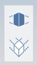

# Orthographic Camera

The Orthographic Camera feature works the same in FormIt Web as it dies in FormIt Windows. To learn more about the Orthographic Camera, see [Orthographic Camera for Windows.](https://app.gitbook.com/@formit3d/s/autodesk-formit-360-windows-help/tool-library/orthographic-camera)

