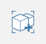
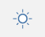
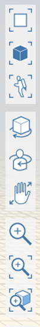

# User Interface

## Main Toolbar

* The main toolbar is at the top of the screen and contains tools to assist in creating, editing, and sharing content.

  

*  Menu: access a variety of file-related operations such as Open, Save, Import, Export.
*  Sketch Name: Click to rename the sketch.
*  Undo and Redo: Click to undo or redo recent actions. Undo and Redo is per-Group.
*  Selection Filter: Click to choose options for filtering out object types when using area select \(click and drag with Select tool\).
* Measure Tools: Click to choose between Linear and Angular Measure tools.
*  Sketch Tools: Click to choose from various Sketch tools such as Line, Arc, Spline, Rectangle, and Circle.
*  Primitives: Click to choose from various 3D shapes such as Cube, Dome, Pyramid, Cylinder, Roof.
*  Advanced Tools: Click to choose from advanced tools such as Boolean Join and Cut, Sweep, Cover, Loft, 3D Offset, 3D Shell, and Fillet.
*  Groups: Click to choose from Group tools such as Create, Edit, Make Unique, Ungroup, Ungroup All, and Flatten.
*  Sun and Shadows: Use this tool to change the date and time of day to study shadows on your model. For more information on sun and shadows, see [Sun and Shadow Settings](https://github.com/formit3d/autodesk-formit-360-web-help/tree/b94092a615fd6c673021a2b2f7cc67dcd4ba45ce/Building%20Performance/Sun%20and%20Shadow%20Settings.md). You may also launch Solar Analysis from within this panel.
*  Settings: Click to set application and sketch settings, such as snapping, editable dimensions, selection and context visibility, and units.
*  Search for a location and import satellite imagery into your sketch. For more information on setting the location of your sketch, see [Location](../location/).
*  Energy Analysis: Click to perform calculations on a building to determine its energy use using Autodesk Insight.
*  Go Pro! Click to gain access to Solar Analysis, Energy Analysis, and Collaboration features.
*  Log in with your Autodesk account. You can use BIM 360 Docs cloud services to store and share your sketches.

*  Help: Click to find out what FormIt is about, what's new in this release, and get access to forums, galleries, videos, and learn application shortcuts.

## Floating Navigation Toolbar

|  |  |
| :--- | :--- |
|  | _Top View_: Go to a top-down orthogonal view  _3D View_: Go to the default 3D perspective view  _Fly Through_: Walk around your model using gaming-inspired controls: W/A/S/D to move around, SPACE to fly, Q/E/F to move up/down/fall to ground, SCROLL while moving to adjust speed, ESC to exit  ----------  _Orbit_: Orbits around using your cursor or selection as the center of rotation. You can also right-click and drag at any time to Orbit.  _Swivel_: Looks around the model by using the current position as the center point. You can also hold Ctrl while right-click and dragging to Swivel.   _Pan_: Drags the view parallel to the screen. You can also hold the middle mouse button, or Shift while right-click and dragging to Pan.  ----------  _Zoom_: Zooms in or out with cursor movement  _Zoom All_: Zooms out to capture the extents of the sketch   _Zoom Selected_: Zooms to capture the extents of the geometry in selection  |

## Palette Bar

The Palette Bar appears on the right side of the screen. Click one of these icons to open a side palette to display Properties, Layers, Scenes, Levels, Content Library, and Collaboration.

|  |  |
| :--- | :--- |
|  |  _Properties_: Open this palette to view location, gross area, and floor area ratios for your sketch  _Materials_: Use this palette to create or apply materials  _Layers_: Create and manage Layers and assign selected objects to different Layers  _Scenes_: Create, manage, and play Scenes  _Levels_: Use this palette to display and add Levels to your building objects  _Content Library_: Use the Content Library to store reusable content such as furniture  _Collaboration_ \(FormIt Pro only\): Use Collaboration to work simultaneously with others as you create designs  |

