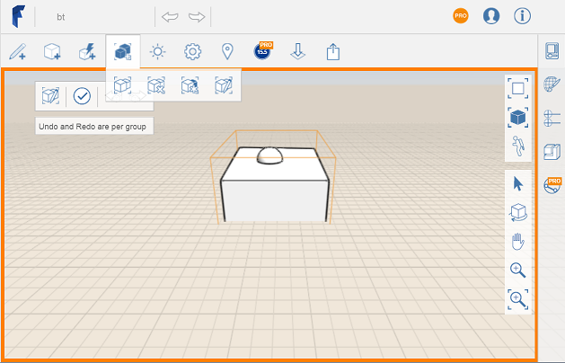

# Edit Group

Update or make changes to an existing group.

1. Click the Edit Groups icon on the toolbar. 
2. Click on the group you wish to edit.
3. Modify geometry to make edits to group objects.
4. When you complete your edits, click \(Finish\) in the upper left corner.

   

