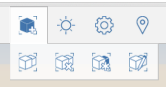
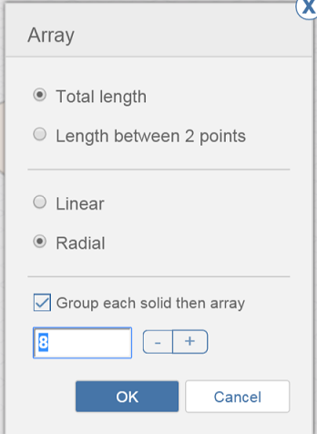

# Using Groups

Bundle together one or more objects into clusters that you can easily manipulate.

Groups help you create geometry more efficiently.

* After you create objects by placing primitives or sketching shapes, you can group sets of them together so that they are treated as a single reusable object. You can copy a group to create _instances_, objects that are linked so that making changes to one will update the others. Groups are useful for organizing your sketch and when you quickly want to update similar objects.
* A toolbar provides ready access to the grouping tools: Group, Ungroup, Make Unique, and Edit \(these tools also appear on the Context Menu\). The Toolbar tools let you choose an action first, followed by the object on which you want to execute the action. The Context menu reverses this order \(at the cost of one extra click\): You choose an object first and then choose an action to perform on that object. This action/selection order makes Toolbar Edit the better choice to edit nested groups. You can also use keyboard shortcuts: G, E, F \(Group, Edit, Finish\) plus U \(Ungroup\) and M \(Make Unique\).

 

Only certain elements of an object can be grouped: an entire object, a face, and an independent edge. Vertices and owned edges cannot be grouped.

You can create an array of objects from a single instance and select a check box to group the arrayed objects.

## Topics in this section

* [Group/Ungroup Objects](https://github.com/formit3d/autodesk-formit-360-web-help/tree/b94092a615fd6c673021a2b2f7cc67dcd4ba45ce/Group-Ungroup%20Objects.md)

  Place geometry into clusters to allow easier manipulation.

* [Edit Group](https://github.com/formit3d/autodesk-formit-360-web-help/tree/b94092a615fd6c673021a2b2f7cc67dcd4ba45ce/Edit%20Group.md)

  Update or make changes to an existing group.

* [Make Group Unique](https://github.com/formit3d/autodesk-formit-360-web-help/tree/b94092a615fd6c673021a2b2f7cc67dcd4ba45ce/Make%20Group%20Unique.md)

  Copy a set of objects and then disconnect them from the original Group definition.

* [Nest Groups](https://github.com/formit3d/autodesk-formit-360-web-help/tree/b94092a615fd6c673021a2b2f7cc67dcd4ba45ce/Nest%20Groups.md)

  Cluster like elements within a design.

* [Scale a Group](https://github.com/formit3d/autodesk-formit-360-web-help/tree/b94092a615fd6c673021a2b2f7cc67dcd4ba45ce/Scale%20a%20Group.md)

  Scale a Group instance while maintaining the relationship to other instances

* [Apply Levels and Materials to a Group ](https://github.com/formit3d/autodesk-formit-360-web-help/tree/b94092a615fd6c673021a2b2f7cc67dcd4ba45ce/Apply%20Levels%20and%20Materials%20to%20a%20Group.md)

  A way to affect many objects at once.

* [Group Axes and Work Planes](https://github.com/formit3d/autodesk-formit-360-web-help/tree/b94092a615fd6c673021a2b2f7cc67dcd4ba45ce/Group%20Axes%20and%20Work%20Planes.md)

