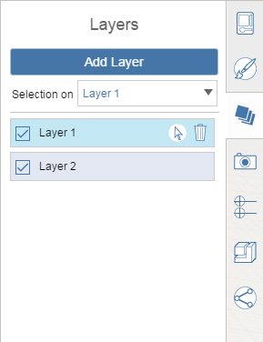

# Layers

Use the layers to control the visibility of individual objects.

## Create and Modify Layers

1. Click Add Layer in the Layer palette to create a new layer.
2. Double click on the name to rename the layer.
3. To add objects to the layer, select one or more objects in the scene and then choose the desired layer from the Selection On drop down list.

## Using Layers

1. To turn the layer visibility off, click the checkbox next to the layer name.
2. To select all object\(s\) on the layer, click the selection icon next to the layer name
3. To delete a layer, click the trash icon next to the layer name. Only the layer, not the objects assigned to the layer, will be deleted.

