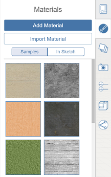

# Using Materials

Enrich and enhance designs using Materials to add detail.

The Material Editor is located in the right-side palette. In the Editor, you can create new materials and add them to your Material Library. To add color to a material, you can use the color picker to accurately set the tint for the material or select a predefined color swatch.

* You can use one of the sample materials from the included library, you can create your own, or you can import a material from the Autodesk Material Library \(available for the [FormIt Pro Subscription](http://www.autodesk.com/products/formit-360/try-buy) only.\) Materials allow you to add detail to the geometry in your sketch.

  

## Topics in this section

* [Create a Material](https://github.com/formit3d/autodesk-formit-360-web-help/tree/b94092a615fd6c673021a2b2f7cc67dcd4ba45ce/Visualizing%20Your%20Design/Create%20a%20Material.md)

  Use the Material Editor to create new materials to use in your scene.

* [Edit a Material](https://github.com/formit3d/autodesk-formit-360-web-help/tree/b94092a615fd6c673021a2b2f7cc67dcd4ba45ce/Visualizing%20Your%20Design/Edit%20a%20Material.md)

  Use the Material Editor to make materials appear exactly as you want.

* [Apply a Material](https://github.com/formit3d/autodesk-formit-360-web-help/tree/b94092a615fd6c673021a2b2f7cc67dcd4ba45ce/Visualizing%20Your%20Design/Apply%20a%20Material.md)

  Use the Material Editor to place a material on an object or a selected object face.

