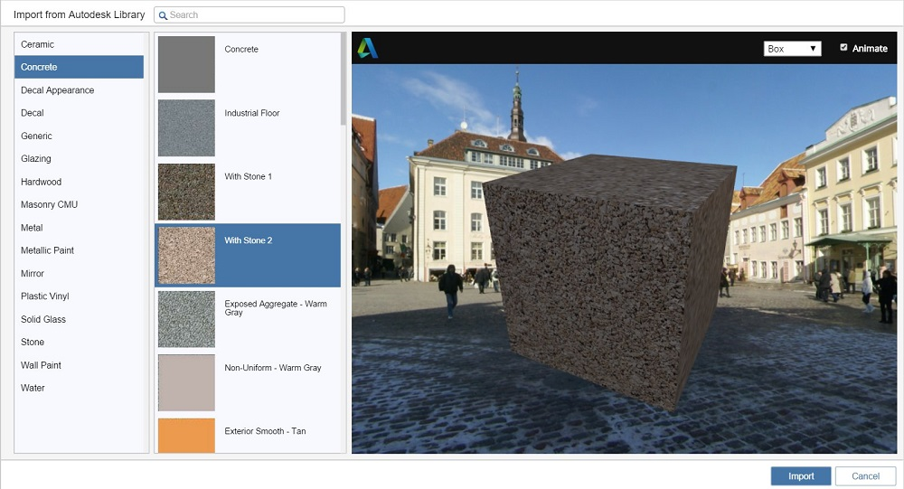

# Create a Material

Use the Material Editor to create new materials to use in your scene.

You can create your own materials based on custom bitmap files.

## Create a Material

1. Click the Add Material Button.
2. From the [Edit Material](https://github.com/formit3d/autodesk-formit-360-web-help/tree/b94092a615fd6c673021a2b2f7cc67dcd4ba45ce/Visualizing%20Your%20Design/Edit%20a%20Material.md) window, make the necessary changes to the material properties.
3. Click OK to save the changes to the material.

## Import an Autodesk Material 

If you have purchased the optional [FormIt Pro Subscription](http://www.autodesk.com/products/formit-360/try-buy), you will be able to import materials from the Autodesk Materials library.

1. Click Import Material from the Material Palette.
2. From the Import Material, browse or search by name to select a material to import into the scene and click OK.
3. The material can now be [applied](https://github.com/formit3d/autodesk-formit-360-web-help/tree/b94092a615fd6c673021a2b2f7cc67dcd4ba45ce/Visualizing%20Your%20Design/Apply%20a%20Material.md) or [edited](https://github.com/formit3d/autodesk-formit-360-web-help/tree/b94092a615fd6c673021a2b2f7cc67dcd4ba45ce/Visualizing%20Your%20Design/Edit%20a%20Material.md) like any other material.

