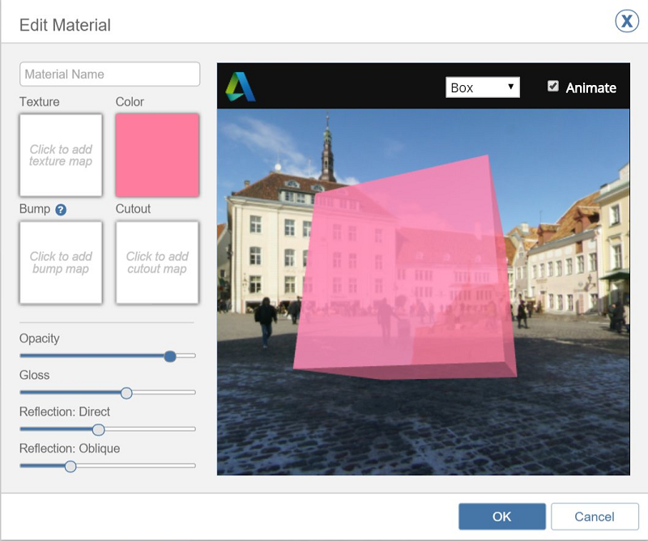

# Edit a Material

Use the Material Editor to make materials appear exactly as you want.

The texture, color, and other properties of Materials can be modified in the Material Editor.

## Edit a Material

1. Select a material.
2. Choose the Edit icon.
3. 
4. From the Edit Material window, you can change the following properties - which will update the preview image on the right.
   * _Name_: To help identify the material
   * _Texture_:Textures are images loaded from your local drive. Once imported, you can crop, and edit the horizontal and vertical scale of the texture.

     

   * _Color_: When a material has both texture and color, the two are multiplied together.
   * _Bump_: Load a texture to apply bumpiness based on the image.
   * _Cutout_: Load a black and white bitmap. The white areas will appear solid and the black areas will be transparent.
   * _Opacity_: A higher value means the material will be more transparent.
   * _Gloss_: A higher value will add a shiny gloss effect to the material.
   * _Reflection Direct_: A higher value will increase the amount of reflectivity visible when looking directly at a face.
   * _Reflection: Oblique_: A higher value will increase the amount of reflectivity visible when looking at a face from an oblique angle.
5. Click OK to save the changes to the material.

