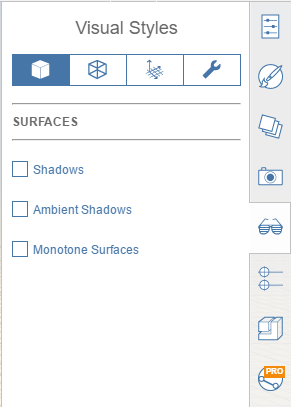

# Visual Styles

Visual Styles provides a one-stop shop for tweaking the display of a model's surfaces, edges, and its environment. Visual Styles also provides options for toggling helpful diagnostic options.

## Surfaces

* **Shadows:** Display shadows based on sketch location and selected time of day.
* **Ambient Shadows:** Display soft shadows for an added touch of realism.
*  **Monotone Surfaces:** Display all surfaces with a white material, except transparent surfaces which become grey. Great for shadow studies.

## Edges

* **Edges:** Display edges on the model.
* **Contrast:** Adjust the relative visibility of edges against model surfaces.
* **Thick Edges:** Display thickened edges.
* **Sketchy Edges:** Display edges with a sketch-like effect.
* **Hidden Edges:** Display edges behind surfaces for a wireframe effect.
* **Extended Edges:** Draw a slight extension to edges for a sketch-like effect.
* **Silhouettes:** Display thicker lines around perimeters of objects to emphasize form.
* **Silhouette Contrast:** Adjust the relative visibility of silhouette edges against model surfaces.

## Environment

* **Grid:** Display the grid on the ground.
* **Ground Plane:** Display the colored opaque effect on the ground.
* **Axes:** Display the XYZ axes indicators at the origin.
* **North Arrow:** Display a helpful north arrow indicator in the bottom-left corner of the screen.
* **Levels:** Display levels on objects that have Levels enabled in the Properties palette.

## Diagnostics

* **Identify Watertight Issues:** Highlight non-manifold edges in a red color to help clean up models for sending to other applications, and for identifying potential model fidelity issues.
* **Identify Back Faces:** Highlight faces that are reversed to help clean up models for sending to other applications, and for identifying potential model fidelity issues.
* **Show Group Bounding Boxes:** Draw bounding boxes for all Groups and nested Groups in the sketch.
* **Show Default Color on back Faces:** Checking this overrides any faces that may have a back face material with the default FormIt color.

